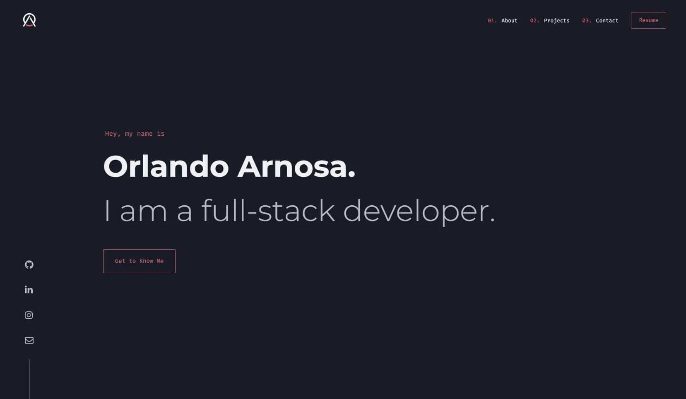

<div align="center">
  
</div>

<h1 align="center">
  Orlando Arnosa Portfolio
</h1>

<h4 align="center">
  The first iteration of <a href="https://orlandoarnosa.com" target="_blank">orlandoarnosa.com</a> built with <a href="https://www.reactjs.org/" target="_blank">React</a> and hosted on <a href="https://www.netlify.com/" target="_blank">Netlify</a>
</h4>

<p align="center">
  <a href="https://app.netlify.com/sites/orlandoarnosa/deploys" target="_blank">
    
  </a>
</p>

<p align="center">
  <a href="#how-to-use">How To Use</a> •
  <a href="#color-reference">Color Reference</a> •
  <a href="#license">License</a>
</p>



## How To Use

To clone and run this application, you'll need [Git](https://git-scm.com) and [Node.js](https://nodejs.org/en/download/) (which comes with [npm](http://npmjs.com)) installed on your computer. From your command line:

```bash
# Clone this repository
$ git clone https://github.com/oarnosa/portfolio.git

# Go into the repository
$ cd portfolio

# Install dependencies
$ npm install

# Run the app
$ npm start
```

## Color Reference

<table style="width:100%">
  <tr>
    <th>Color</th>
    <th>RGB</th>
    <th>HEX</th>
  </tr>
  <tr align=center>
    <td>Navy</td>
    <td>rgb(24, 28, 39)</td>
    <td>#181c27</td>
  </tr>
  <tr align=center>
    <td>Dark Navy</td>
    <td>rgb(17, 21, 32)</td>
    <td>#111520</td>
  </tr>
  <tr align=center>
    <td>Dark Grey</td>
    <td>rgb(37, 45, 56)</td>
    <td>#252d38</td>
  </tr>
    <tr align=center>
    <td>Red</td>
    <td>rgb(218, 98, 106)</td>
    <td>#da626a</td>
  </tr>
    <tr align=center>
    <td>White</td>
    <td>rgb(239, 241, 245)</td>
    <td>#eff1f5</td>
  </tr>
</table>

## License

- **[MIT license](http://opensource.org/licenses/mit-license.php)**
- Copyright 2020 © <a href="http://orlandoarnosa.com" target="_blank">Orlando Arnosa</a>.

---

> [orlandoarnosa.com](https://www.orlandoarnosa.com) &nbsp;&middot;&nbsp; [oarnosa@gmail.com](mailto:oarnosa@gmail.com) &nbsp;&middot;&nbsp;
> GitHub [@oarnosa](https://github.com/amitmerchant1990) &nbsp;&middot;&nbsp;
> LinkedIn [/in/oarnosa](https://linkedin.com/in/oarnosa)
