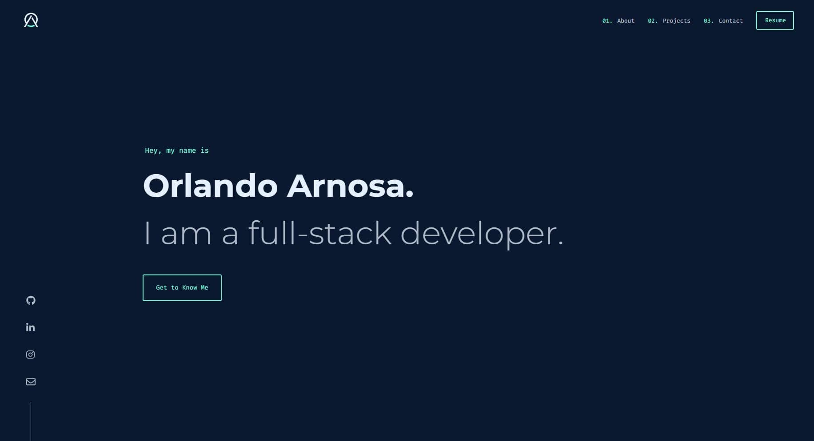

<div align="center">
  
</div>
<h1 align="center">
  Orlando Arnosa<br/>Portfolio
</h1>
<p align="center">
  The first iteration of <a href="https://orlandoarnosa.com" target="_blank">orlandoarnosa.com</a> built with <a href="https://www.reactjs.org/" target="_blank">React</a> and hosted on <a href="https://www.netlify.com/" target="_blank">Netlify</a>
</p>
<p align="center">
  <a href="https://app.netlify.com/sites/orlandoarnosa/deploys" target="_blank">
    
  </a>
</p>



## Installation & Setup

1. Clone this repo to your local machine

   ```sh
   git clone https://github.com/oarnosa/portfolio.git
   ```

2. Install and use the latest version of Node using [NVM](https://github.com/nvm-sh/nvm)

   ```sh
   nvm install
   ```

3. Install dependencies

   ```sh
   yarn
   ```

4. Start the development server

   ```sh
   yarn start
   ```

## Color Reference

<table style="width:100%">
  <tr>
    <th>Color</th>
    <th>RGB</th>
    <th>HEX</th>
  </tr>
  <tr align=center>
    <td>Navy</td>
    <td>rgb(24, 28, 39)</td>
    <td>#181c27</td>
  </tr>
  <tr align=center>
    <td>Dark Navy</td>
    <td>rgb(17, 21, 32)</td>
    <td>#111520</td>
  </tr>
  <tr align=center>
    <td>Dark Grey</td>
    <td>rgb(37, 45, 56)</td>
    <td>#252d38</td>
  </tr>
    <tr align=center>
    <td>Red</td>
    <td>rgb(218, 98, 106)</td>
    <td>#da626a</td>
  </tr>
    <tr align=center>
    <td>White</td>
    <td>rgb(239, 241, 245)</td>
    <td>#eff1f5</td>
  </tr>
</table>
